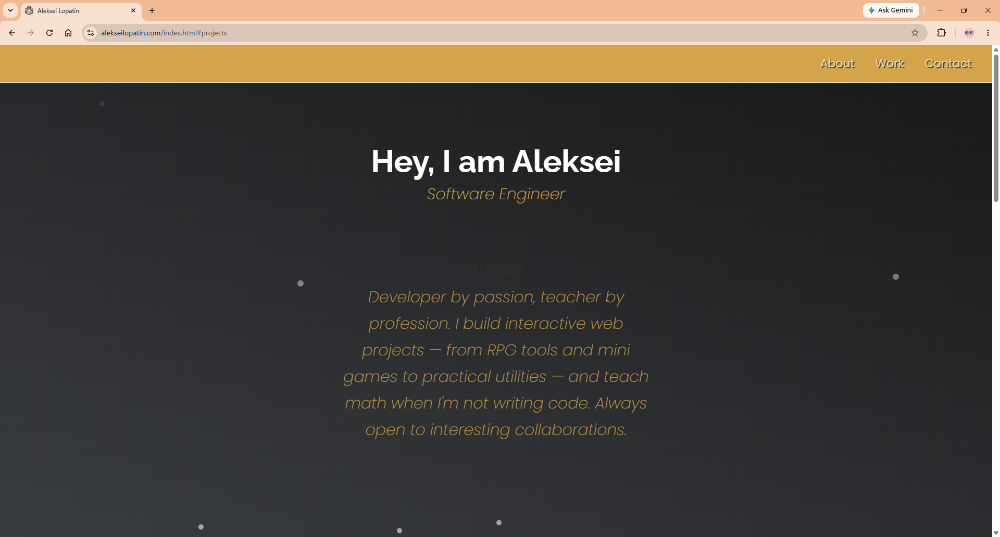

<h1 align="center">www.alekseilopatin.com</h1>

<p align="center">My personal portfolio site — built from scratch in vanilla HTML, CSS, and JavaScript. No frameworks, no build step, no dependencies.</p>

<p align="center">
  <a href="https://www.alekseilopatin.com">
    
  </a>
  
  
  
  
</p>

<p align="center">
  
</p>

---

## About

This repo contains the source code for my personal portfolio site, plus 20 small interactive projects I've built while learning front-end development. The site is hosted on GitHub Pages and served from a custom domain.

Every project in this repo is hand-written vanilla JavaScript — no React, no Vue, no bundlers. The goal was to build a strong foundation in the language itself before reaching for libraries.

## Live site

Visit **[alekseilopatin.com](https://www.alekseilopatin.com)** to see everything in action. Each project below also links directly to its live demo.

## Projects

### Full-stack

| Project | Stack | What it does |
|---|---|---|
| [School Portal](https://school.alekseilopatin.com) | Next.js · Supabase · Tailwind | Multilingual school management app — news feed, gradebook, and student art gallery. Teacher login with role-based access. Deployed on Vercel. |

### Web apps & utilities

| Project | What it does |
|---|---|
| [Stopwatch](https://www.alekseilopatin.com/projects/stopwatch/stopwatch.html) | Start / stop / lap timer with millisecond precision |
| [Music Player](https://www.alekseilopatin.com/projects/musicPlayer/musicPlayer.html) | Browser-based audio player with a playlist |
| [Todo App](https://www.alekseilopatin.com/projects/todoApp/todoApp.html) | Classic add / complete / delete task manager |
| [Shopping Cart](https://www.alekseilopatin.com/projects/shoppingCart/shoppingCart.html) | Add items, adjust quantities, calculate totals |
| [Calorie Counter](https://www.alekseilopatin.com/projects/calorieCounter/calorieCounter.html) | Track daily calorie intake against a budget |
| [Spreadsheet](https://www.alekseilopatin.com/projects/spreadsheet/spreadsheet.html) | Mini Excel-style spreadsheet with formulas |
| [Student Cards](https://www.alekseilopatin.com/projects/studentCards/studentCards.html) | Student record cards with editable fields |
| [Newspaper Layout](https://www.alekseilopatin.com/projects/newspaperLayout/newspaperLayout.html) | CSS layout exercise — print-style newspaper page |

### Converters & calculators

| Project | What it does |
|---|---|
| [Date Formatter](https://www.alekseilopatin.com/projects/dateFormatter/dateFormatter.html) | Convert dates between common formats |
| [Decimal to Binary](https://www.alekseilopatin.com/projects/decimalToBinary/decimalToBinary.html) | Convert decimal numbers to binary, with steps |
| [Roman Numerals Converter](https://www.alekseilopatin.com/projects/romanToNumeral/romanToNumeral.html) | Convert numbers to Roman numerals |
| [Statistics Calculator](https://www.alekseilopatin.com/projects/statisticsCalculator/statisticsCalculator.html) | Mean, median, mode, range from a number list |
| [Palindrome Checker](https://www.alekseilopatin.com/projects/palindrome/palindrome.html) | Check whether a string reads the same forwards and backwards |
| [Telephone Number Validator](https://www.alekseilopatin.com/projects/phoneValidator/phoneValidator.html) | Validate US phone number formats |

### Mini games

| Project | What it does |
|---|---|
| [Dragon Repeller](https://www.alekseilopatin.com/miniGames/dragonRepeller/dragonRepeller.html) | Text-based RPG — fight monsters, level up, defeat the dragon |
| [Rock, Scissors, Paper, Lizard, Spock](https://www.alekseilopatin.com/miniGames/rockScissorsPaper/rockScissorsPaperLizardSpock.html) | The Big Bang Theory variant of the classic game |
| [Platformer Game](https://www.alekseilopatin.com/miniGames/platformer/platformer.html) | Side-scrolling jump-and-run platformer |
| [Advanced Dice Game](https://www.alekseilopatin.com/miniGames/advancedDiceGame/advancedDiceGame.html) | Multi-round dice game with scoring rules |

### RPG tools

| Project | What it does |
|---|---|
| [Critical Hits for D&D](https://www.alekseilopatin.com/rpgTools/criticalHits/criticalHits.html) | Look up extended D&D critical-hit results by damage type |
| [Operations Generator for Bands of Blades](https://www.alekseilopatin.com/rpgTools/operationGenerator/operationsGenerator.html) | Procedurally generates operations for the *Band of Blades* TTRPG |

## Tech stack

- **HTML5** — semantic markup
- **CSS3** — flexbox, grid, custom properties, responsive design
- **Vanilla JavaScript** — DOM manipulation, event handling, local storage, no frameworks
- **GitHub Pages** — hosting
- **Custom domain** via CNAME

## Project structure

```
alekseilopatin.github.io/
├── index.html              # Home page
├── styles.css              # Site-wide styles
├── script.js               # Site-wide scripts
├── kombucha.html           # Personal/blog page
├── kombuchaBenefits.html
├── projects/               # Web apps, calculators, converters
│   ├── stopwatch/
│   ├── musicPlayer/
│   ├── todoApp/
│   └── ...
├── miniGames/              # Browser games
│   ├── dragonRepeller/
│   ├── platformer/
│   └── ...
├── rpgTools/               # Tools for tabletop RPGs
│   ├── criticalHits/
│   └── operationGenerator/
├── randomQuoteMachine/
├── stopwatch/
├── media/                  # Images and other assets
├── CNAME                   # Custom domain config
├── robots.txt
├── sitemap.xml
└── LICENSE
```

## Local development

No build step — just open `index.html` in a browser, or serve the folder with any static server:

```bash
# With Python
python -m http.server 8000

# With Node
npx serve

# Then open http://localhost:8000
```

## Roadmap

- [ ] Refactor shared UI patterns into reusable components
- [ ] Add a dark mode toggle across the site
- [ ] Improve mobile layouts on the older project pages
- [ ] Lighthouse pass for accessibility and performance

## License

The code in this repository is released under the [MIT License](LICENSE). Personal content (text, images, the "About" copy) is © Aleksei Lopatin and not covered by the license.
